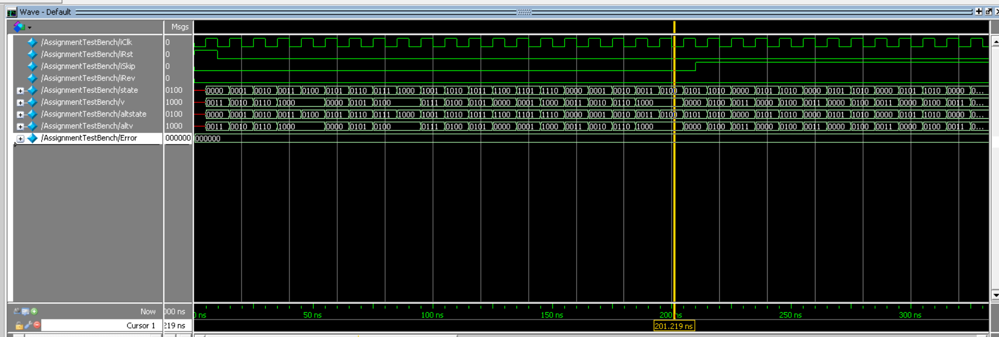
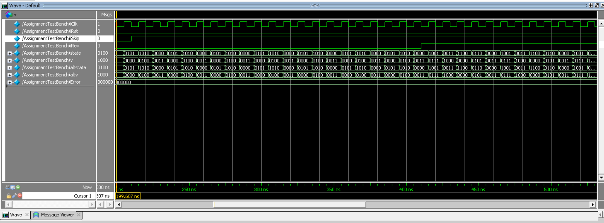
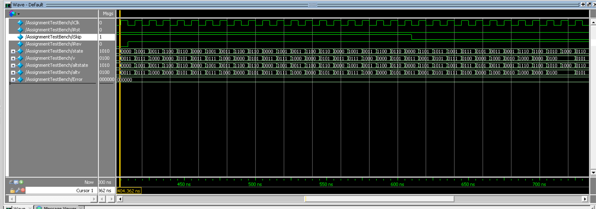
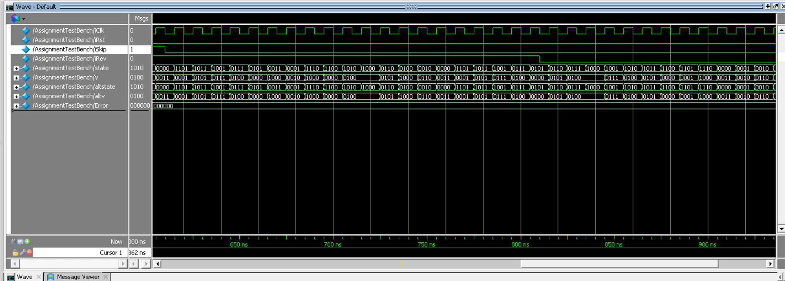
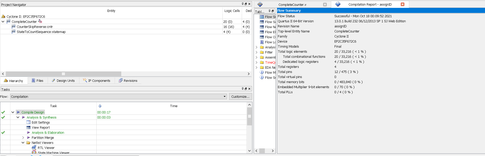

# Finite State Machine and Counter Project

Welcome to the Finite State Machine and Counter project repository by Avvienash. This repository showcases the implementation of a finite state machine (FSM) and counter circuit.

## Project Overview

This project involves the design and implementation of a sequence counter circuit using Verilog. The core components of the project include an 8-bit counter and an FSM, which dictate the sequence of states and transitions within the circuit.

## Code Explanation

### Finite State Machine (FSM)

The FSM in this project is designed to control the sequence of states within the circuit. Here's a breakdown of its key components and functionality:

- **States**: The FSM consists of a set of states, each representing a specific phase or operation in the circuit. These states are defined as enumerations or constants in the Verilog code.

- **State Transitions**: Transitions between states are governed by specific conditions or triggers. These triggers could be based on input signals, button presses, or other criteria.

- **State Diagram**: A state diagram is often used to visualize the FSM's behavior. It illustrates the states, transitions, and conditions that guide the circuit's operation.

### 8-Bit Counter

The 8-bit counter is a crucial component of this project, responsible for keeping track of the current count or position within the sequence. Here's how it works:

- **Counting**: The counter increments its value by 1 with each clock cycle. It can count up to 255 (assuming an 8-bit implementation) before rolling over to 0.

- **Reset**: There is usually a reset mechanism to set the counter back to an initial value, ensuring that the sequence starts from the beginning when required.

### Combining FSM and Counter

The FSM and counter work in tandem to achieve the desired sequence of operations. The FSM controls when and how the counter increments, effectively defining the sequence's flow.

## Results

### Assignment Q2 - Images

*This image represents an aspect of Assignment Q2, illustrating a specific state or transition in the FSM.*

*Another image related to Assignment Q2, providing further insights into the FSM's behavior.*

*An additional visual from Assignment Q2, contributing to a comprehensive understanding of the FSM.*

*Yet another image tied to Assignment Q2, showing critical aspects of the FSM's operation.*

### Assignment Q3 - Video

- `Q3_FPGA_32281013.mp4`: This video demonstrates Assignment Q3, offering a real-time view of the circuit in action. It provides valuable insights into the functionality and behavior of the implemented FSM and counter.

### Assignment Q3 - Image

*This image is related to Assignment Q3 and complements the video, showcasing the design within Quartus software.*

### Assignment Q4 - Discussion

The project's sequence counter circuit has several real-world applications, including:

1. **Time Base Counter**: It can serve as a time base counter, useful for applications such as stopwatches, timers, and clocks. The buttons iSkip and iRev can be customized to control actions like pausing.

2. **Home Appliances**: The concept of these circuit counters can be applied to replace analog clocks with digital displays in home appliances like ovens and washing machines. It enables precise control of operations.

3. **Digital Signal Processing (DSP)**: The FSM and counter are fundamental in DSP applications, where they can process sequences of signals such as voice, audio, video, temperature, and pressure. The buttons can be used for signal manipulation.

4. **Traffic Lights**: The circuit's principles align with traffic light control systems. Each traffic light follows a sequence (Green, Yellow, Red), just like the FSM. Inputs, such as the presence of cars or road crossers, influence state transitions, resembling the project's operation.

For a more detailed explanation of the circuit's applications, please refer to the [references](#references) section.

## References

1. [What Is a Digital Counter? Types and Applications](https://www.watelectronics.com/what-is-a-digital-counter-types-applications/)
2. [Washing Machine Display Panel](https://www.multisim.com/content/Jruvf8ZwPn3AQKgpybJKcf/washing-machine-display-panel/)
3. [State Machine Diagram for Oven](https://online.visual-paradigm.com/diagrams/templates/state-machine-diagram/oven/)
4. [Finite State Machine - ScienceDirect](https://www.sciencedirect.com/topics/engineering/finite-state-machine)
5. "Application of Dynamic Counter Circuits in Programmable Digital Pixel Sensor Architectures" by M. Habibi
6. "Smart Traffic Light Control System" by Bilal Ghazal, Khaled Khatib, Khaled Chahine, Mohamad Kherfan (2016)
   [DOI: 10.1109/EECEA.2016.7470780]

